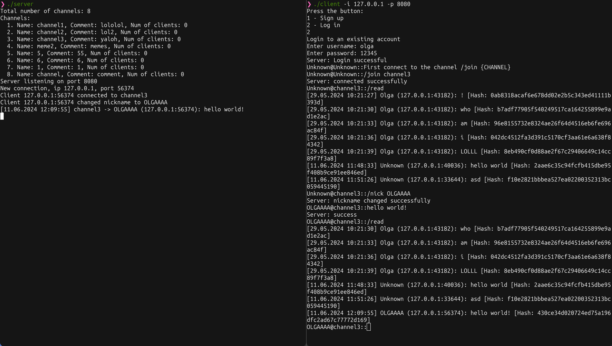
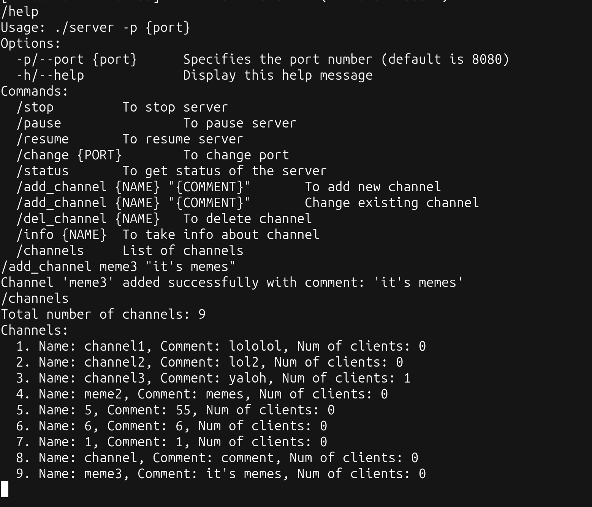
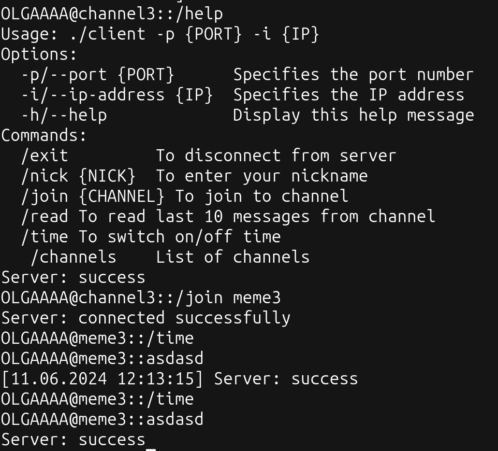

# client-server
* ## Desription

This project implements a chat server and client application using C. The chat server manages multiple clients, allows them to communicate with each other in real-time, and supports various administrative commands. The client application connects to the server, allowing users to send messages, join channels, and interact with other users.

* ## Commands to setup server/client on VM:
```bash 
sudo yum install git && git clone http://gitlab.testvdi.ru/protocol/client-server && sudo yum install gcc && sudo yum install openssl-devel && sudo yum install openssl-devel
```

* ## Guide to build

From client-server/build directory

```bash
make # - to build client and server
make rebuild # - to clear build directory and remake client and server
make test_client_send # - to build send'er
```

* ## Guide to start

From client-server/build directory

```bash
./server -p <PORT>
./client -i <IP_ADDRESS> -p <PORT>

# For both next tests you need to rewrite first line in messages.txt (if you use template)
# First line in messages.txt in format <IP>:<PORT> <NICKNAME> <CHANNEL>
# Second line will be TEST STARTED
# Next lines with messages to send for test
./test_client_send> -f <MESSAGES.TXT> -t <SECONDS>
python3 test_client_read
```

* ## Example of usage

`Example of simple usage (left side - server, right side - client)`

* ### You can type /help to see all commands on the server or clients

`Here is some examples of using server commands`


`Here is some examples of using client commands`


